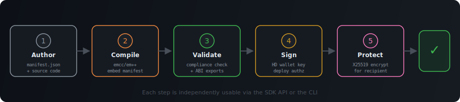
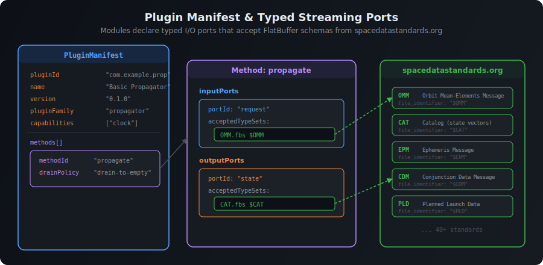

# Space Data Module SDK

A unified SDK for building, validating, signing, and deploying **WebAssembly plugin modules** that run anywhere on the [Space Data Network](https://digitalarsenal.github.io/space-data-network/) — from [OrbPro](https://orbpro.ai) desktops to SDN peer nodes, ground stations, and browsers.

The space domain has a fragmentation problem: every platform ships its own plugin format, its own manifest schema, its own packaging conventions. A propagator written for one system can't run on another without a rewrite. This SDK solves that by defining a **single canonical module format** — a WebAssembly binary with an embedded [FlatBuffers](https://digitalarsenal.github.io/flatbuffers/) manifest — that every runtime in the ecosystem understands.

Modules declare **typed streaming ports** that accept data conforming to [spacedatastandards.org](https://spacedatastandards.org) schemas (OMM, CAT, EPM, CDM, and 40+ others). A propagator that consumes OMM messages and emits state vectors works identically whether it's running inside OrbPro's 3D scene, processing data on an SDN relay node, or executing at the edge on a ground station.

<p align="center">
  
</p>

## How It Works

The SDK handles the full module lifecycle — from source code to a signed, encrypted, deployment-ready package:

<p align="center">
  
</p>

1. **Author** a JSON manifest declaring your module's identity, methods, typed I/O ports, host capabilities, and the [spacedatastandards.org](https://spacedatastandards.org) schemas it consumes and produces.
2. **Compile** your C/C++ source (via Emscripten) into a `.wasm` binary with the manifest automatically embedded as a FlatBuffers blob that runtimes can read at load time.
3. **Validate** the manifest and artifact against compliance rules — correct port declarations, canonical capability IDs, required WASM ABI exports (`plugin_get_manifest_flatbuffer`, `plugin_get_manifest_flatbuffer_size`), and schema resolution against the standards catalog.
4. **Sign** the package with an HD-wallet-derived secp256k1 key, producing a deployment authorization that binds the manifest hash, WASM hash, target, and granted capabilities.
5. **Protect** the signed package by encrypting it for a specific recipient using X25519 key agreement + AES-256-GCM, so modules can be transported securely across the network.

## Manifest & Typed Ports

Every module carries a manifest that declares **what data it can process**. Methods expose typed input and output ports, and each port declares the FlatBuffer schemas it accepts — referencing standards by schema name and file identifier:

<p align="center">
  
</p>

This means runtimes can **automatically wire modules together** — connecting a propagator's `CAT` output to a conjunction screener's `CAT` input — without any glue code. The type system ensures only compatible modules get connected.

## Ecosystem

This SDK is one piece of the Space Data Network stack:

| Project | Role |
|---|---|
| [Space Data Network](https://digitalarsenal.github.io/space-data-network/) | Peer-to-peer network for space data exchange |
| [spacedatastandards.org](https://spacedatastandards.org) | 40+ canonical FlatBuffer schemas for space operations data (OMM, EPM, CAT, CDM, etc.) |
| [FlatBuffers schemas](https://digitalarsenal.github.io/flatbuffers/) | Binary serialization layer used across the entire network |
| [OrbPro](https://orbpro.ai) | Space domain awareness platform — one of the runtimes that hosts these modules |
| [hd-wallet-wasm](https://github.com/nicktj-dev/hd-wallet-wasm) | HD wallet primitives for module signing and identity |

## Install

```bash
npm install space-data-module-sdk
```

## Quick Start

```js
import {
  encodeManifest, decodeManifest,   // FlatBuffers manifest codec
  checkCompliance,                   // validate against standards
  signManifest, verifyManifest,      // HD wallet auth
  encryptPayload, decryptPayload,    // X25519 + AES-256-GCM transport
  compileModule,                     // source-to-wasm compilation
} from "space-data-module-sdk";
```

### Subpath Exports

Each subsystem is available as a standalone import:

```js
import { encodeManifest } from "space-data-module-sdk/manifest";
import { checkCompliance } from "space-data-module-sdk/compliance";
import { signManifest }    from "space-data-module-sdk/auth";
import { encryptPayload }  from "space-data-module-sdk/transport";
import { compileModule }   from "space-data-module-sdk/compiler";
import { resolveStandard } from "space-data-module-sdk/standards";
```

### Environment Compatibility

| Subpath | Node.js | Browser |
|---|---|---|
| `manifest` | Yes | Yes |
| `auth` | Yes | Yes |
| `transport` | Yes | Yes |
| `bundle` | Yes | Yes |
| `compliance` | Yes | No (uses `node:fs`) |
| `compiler` | Yes | No (uses `node:child_process`) |
| `standards` | Yes | No (uses `node:module`) |

## CLI

Every SDK operation is also available from the command line:

```bash
# Validate a manifest + wasm pair against compliance rules
npx space-data-module check --manifest ./manifest.json --wasm ./dist/module.wasm

# Compile C/C++ source to a wasm module with embedded manifest
npx space-data-module compile --manifest ./manifest.json --source ./src/module.c --out ./dist/module.wasm

# Sign and encrypt a module package for transport
npx space-data-module protect --manifest ./manifest.json --wasm ./dist/module.wasm --json

# Emit a single-file bundled wasm with the sds.bundle custom section
npx space-data-module protect --manifest ./manifest.json --wasm ./dist/module.wasm --single-file-bundle --out ./dist/module.bundle.wasm
```

## Module Lab

An interactive browser tool for compiling, validating, and packaging modules — useful for exploring the manifest format and testing modules without touching the CLI.

```bash
npm run start:lab
# http://localhost:4318
```

## Plugin Families

Modules declare a `pluginFamily` that tells runtimes what role they serve:

| Family | Purpose |
|---|---|
| `sensor` | Ingest raw data feeds (radar, optical, RF) |
| `propagator` | Orbit propagation and state prediction |
| `renderer` | 3D visualization and scene rendering |
| `analysis` | Data processing, filtering, aggregation |
| `data_source` | External data connectors |
| `comms` | Communications link modeling |
| `shader` | GPU shader programs |
| `sdf` | Signed distance field geometry |
| `infrastructure` | Network and platform services |
| `flow` | Multi-module data flow orchestration |
| `bridge` | Cross-runtime adapters |

## Host Capabilities

Modules request host capabilities by name. The runtime grants or denies them at load time based on the deployment authorization:

`clock` `random` `logging` `timers` `schedule_cron` `http` `tls` `websocket` `mqtt` `tcp` `udp` `network` `filesystem` `pipe` `pubsub` `protocol_handle` `protocol_dial` `database` `storage_adapter` `storage_query` `storage_write` `context_read` `context_write` `process_exec` `crypto_hash` `crypto_sign` `crypto_verify` `crypto_encrypt` `crypto_decrypt` `crypto_key_agreement` `crypto_kdf` `wallet_sign` `ipfs` `scene_access` `entity_access` `render_hooks`

## Runtime Targets

Manifests may also declare coarse runtime targets for compliance and deployment planning:

`node` `browser` `wasi` `server` `desktop` `edge`

The current compliance rules reject obviously impossible capability mixes for the generic browser target, such as raw filesystem access, TCP/UDP sockets, process execution, or scene hooks.

## Reference Node Host

This SDK now includes a reference Node host surface for the first portable capability set:

`clock` `random` `timers` `schedule_cron` `http` `websocket` `mqtt` `filesystem` `tcp` `udp` `tls` `context_read` `context_write` `crypto_hash` `crypto_sign` `crypto_verify` `crypto_encrypt` `crypto_decrypt` `crypto_key_agreement` `crypto_kdf` `process_exec`

It is intentionally a host service layer, not a finalized wasm import ABI. Runtimes can map the same operations into imports, RPC, component-model bindings, or hostcall shims later.

```js
import { createNodeHost } from "space-data-module-sdk";

const host = createNodeHost({
  manifest: {
    capabilities: ["clock", "http", "filesystem", "context_read", "context_write"],
  },
  filesystemRoot: "./runtime-data",
  allowedHttpOrigins: ["https://api.example.com"],
  contextFilePath: "./runtime-data/context.json",
});

const now = host.clock.now();
const response = await host.http.request({
  url: "https://api.example.com/status",
  responseType: "json",
});
await host.filesystem.writeFile("last-status.json", JSON.stringify(response.body, null, 2));
await host.context.set("global", "lastStatusAt", now);
```

The same host can also be driven through string operation ids such as `clock.now`, `websocket.exchange`, `mqtt.publish`, `filesystem.readFile`, `tcp.request`, `udp.request`, `tls.request`, `context.set`, and `crypto.secp256k1.signDigest` via `host.invoke(...)`.

For `process_exec`, `websocket`, `mqtt`, `tcp`, `udp`, and `tls`, pass explicit allowlists such as `allowedCommands`, `allowedWebSocketOrigins`, `allowedMqttHosts`, `allowedMqttPorts`, `allowedTcpHosts`, `allowedTcpPorts`, `allowedUdpHosts`, `allowedUdpPorts`, `allowedTlsHosts`, and `allowedTlsPorts` so deployments can lock the host down to known binaries and network targets.

## Sync Wasm Hostcall ABI

The SDK now includes a first concrete wasm import ABI for the synchronous subset of the host surface. It uses a JSON-over-memory bridge under the import module `sdn_host`:

- `call_json(operation_ptr, operation_len, payload_ptr, payload_len) -> i32`
- `response_len() -> i32`
- `read_response(dst_ptr, dst_len) -> i32`
- `last_status_code() -> i32`
- `clear_response() -> i32`

Use `createNodeHostSyncHostcallBridge(...)` to expose that namespace to a wasm instance backed by the reference Node host. The current sync dispatch layer covers:

`host.runtimeTarget` `host.listCapabilities` `host.listSupportedCapabilities` `host.listOperations` `host.hasCapability` `clock.now` `clock.monotonicNow` `clock.nowIso` `schedule.parse` `schedule.matches` `schedule.next` `filesystem.resolvePath`

If a guest module intentionally imports host functions, compile it with `allowUndefinedImports: true` in `compileModuleFromSource(...)` so the unresolved imports stay in the wasm artifact instead of failing the link step.

## Development

```bash
npm install
npm test
```

Requires Node.js >= 20. Compilation requires [Emscripten](https://emscripten.org/) (`emcc`/`em++`) on `PATH`.

## License

See [LICENSE](LICENSE).
