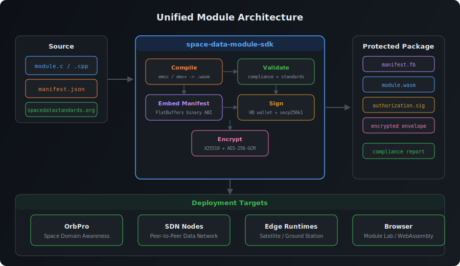

# Space Data Module SDK

`space-data-module-sdk` defines the canonical module artifact for the Space Data
stack: WebAssembly code, an embedded FlatBuffer manifest, a stable capability
vocabulary, a single-file bundle format, and the signing and transport records
used to move modules between hosts.

This repository is the source of truth for module-level concerns:

- `PluginManifest.fbs` and manifest codecs
- embedded manifest exports inside `.wasm` modules
- standards-aware compliance and capability validation
- module compilation and protection
- the `sds.bundle` single-file custom section
- deployment authorization and encrypted transport envelopes
- the first canonical module hostcall/import ABI surface

<p align="center">
  
</p>

## Artifact Model

A module built with this SDK is a `.wasm` artifact with:

- an embedded `PluginManifest.fbs`
- exported manifest accessors:
  - `plugin_get_manifest_flatbuffer`
  - `plugin_get_manifest_flatbuffer_size`
- canonical invoke exports when the artifact supports direct in-memory calls:
  - `plugin_invoke_stream`
  - `plugin_alloc`
  - `plugin_free`
- an exported `_start` entry when the artifact supports WASI command mode
- optional `sds.bundle` custom-section payloads for:
  - manifest bytes
  - deployment authorization
  - detached signatures
  - encrypted transport envelopes
  - auxiliary FlatBuffer or raw payloads

The module contract stays the same whether the artifact is loaded directly,
wrapped in a deployment envelope, or shipped as one bundled `.wasm` file.

## Canonical Invoke ABI

Modules can now declare one or both canonical invoke surfaces in
`manifest.invokeSurfaces`:

- `direct`: in-memory invocation through `plugin_invoke_stream`
- `command`: WASI command-mode invocation through `_start`

Both surfaces consume and produce the same FlatBuffer envelopes:

- `PluginInvokeRequest`
- `PluginInvokeResponse`

Those envelopes route SDS payload frames by `portId` using
`TypedArenaBuffer.fbs` and a shared payload arena. Command mode reads one
request from `stdin` and writes one response to `stdout`. Direct mode takes the
same request bytes from guest memory and returns response bytes in guest
memory.

For simple single-input / single-output methods, command mode also supports a
degenerate raw shortcut:

```bash
wasmedge module.wasm --method echo < input.fb > output.fb
```

That shortcut is only valid when the method declares exactly one input port and
at most one output port.

Source-built modules can include `space_data_module_invoke.h` and use the
generated helper functions to read the active invocation inputs and emit SDS
outputs. The reference invoke examples live in
[`examples/invoke-echo`](./examples/invoke-echo):

- `manifest.direct.json`
- `manifest.command.json`
- `manifest.hybrid.json`
- `module.c`

## Runtime Portability

The module format is language-neutral. A host can load modules from this SDK
anywhere it can:

- instantiate WebAssembly
- read FlatBuffers
- honor the module capability and host ABI contract

That target set matches the WebAssembly and FlatBuffers runtime families already
used in the companion `flatbuffers/wasm` work:

- browser
- Node.js
- C#
- Go
- Java
- Kotlin
- Python
- Rust
- Swift

This repo currently includes:

- the JavaScript reference implementation for manifest, compliance, auth,
  transport, bundle handling, and compilation
- deterministic `sds.bundle` conformance vectors under
  [`examples/single-file-bundle/vectors`](./examples/single-file-bundle/vectors)
- non-JS bundle reference clients in
  [`examples/single-file-bundle/go`](./examples/single-file-bundle/go) and
  [`examples/single-file-bundle/python`](./examples/single-file-bundle/python)
- a reference Node host and sync `sdn_host` bridge for the first hostcall
  surface

## Install

```bash
npm install space-data-module-sdk
```

## Quick Start

```js
import {
  compileModuleFromSource,
  createSingleFileBundle,
  encodePluginManifest,
  parseSingleFileBundle,
  validateManifestWithStandards,
} from "space-data-module-sdk";

const manifestBytes = encodePluginManifest(manifest);
const validation = await validateManifestWithStandards(manifest);
if (!validation.ok) {
  throw new Error("Manifest validation failed.");
}

const compilation = await compileModuleFromSource({
  manifest,
  sourceCode,
  language: "c",
});

const bundle = await createSingleFileBundle({
  wasmBytes: compilation.wasmBytes,
  manifest,
});

const parsed = await parseSingleFileBundle(bundle.wasmBytes);
```

Each subsystem is also available as a subpath export:

```js
import { encodePluginManifest } from "space-data-module-sdk/manifest";
import { validateManifestWithStandards } from "space-data-module-sdk/compliance";
import { createDeploymentAuthorization } from "space-data-module-sdk/auth";
import { encryptJsonForRecipient } from "space-data-module-sdk/transport";
import { compileModuleFromSource } from "space-data-module-sdk/compiler";
import { createSingleFileBundle } from "space-data-module-sdk/bundle";
```

## Single-File Bundles

`sds.bundle` keeps module delivery to one file without changing WebAssembly
loadability. The SDK appends a standard custom section, not raw trailer bytes,
so the bundled artifact still compiles as a normal `.wasm` module.

The reference path lives in
[`examples/single-file-bundle`](./examples/single-file-bundle):

- [`demo.mjs`](./examples/single-file-bundle/demo.mjs) builds and parses a
  bundled module
- [`generate-vectors.mjs`](./examples/single-file-bundle/generate-vectors.mjs)
  regenerates the checked-in conformance vectors
- the `go` and `python` directories show non-JS readers against the same
  bundle contract

## Module Publication

Packages that publish SDN modules now use the canonical `sdn-module`
publication descriptor. That descriptor covers:

- standalone module packages
- attached module artifacts shipped inside another language library
- discovery of bundled wasm, sidecar signatures, and encrypted transport
  FlatBuffers

The full standard is in
[`docs/module-publication-standard.md`](./docs/module-publication-standard.md),
with concrete examples under [`examples/publishing`](./examples/publishing).

For npm packages, the simplest form is:

```json
{
  "name": "@example/orbit-lib",
  "version": "1.2.3",
  "sdn-module": "./dist/orbit-lib.module.wasm"
}
```

When signature or transport metadata is published in the same file, it belongs
inside `sds.bundle`, not as raw bytes after the end of the wasm binary.

## Host ABI

This repo also defines the module-facing capability vocabulary and the first
synchronous hostcall bridge under the import module `sdn_host`.

The current sync import surface is:

- `call_json(operation_ptr, operation_len, payload_ptr, payload_len) -> i32`
- `response_len() -> i32`
- `read_response(dst_ptr, dst_len) -> i32`
- `last_status_code() -> i32`
- `clear_response() -> i32`

Use `createNodeHost(...)` and `createNodeHostSyncHostcallBridge(...)` to run
that contract against the reference Node host while keeping the ABI shape
portable for non-JS hosts.

## Host Capabilities

Modules request capabilities by stable ID. The current recommended vocabulary
includes:

`clock` `random` `logging` `timers` `schedule_cron` `http` `tls` `websocket`
`mqtt` `tcp` `udp` `network` `filesystem` `pipe` `pubsub` `protocol_handle`
`protocol_dial` `database` `storage_adapter` `storage_query` `storage_write`
`context_read` `context_write` `process_exec` `crypto_hash` `crypto_sign`
`crypto_verify` `crypto_encrypt` `crypto_decrypt` `crypto_key_agreement`
`crypto_kdf` `wallet_sign` `ipfs` `scene_access` `entity_access`
`render_hooks`

Manifests can also declare coarse runtime targets for planning and compliance:

`node` `browser` `wasi` `server` `desktop` `edge`

## Environment Notes

| Surface | Node.js | Browser |
|---|---|---|
| `manifest` | Yes | Yes |
| `auth` | Yes | Yes |
| `transport` | Yes | Yes |
| `bundle` | Yes | Yes |
| `compliance` | Yes | No |
| `compiler` | Yes | No |
| `standards` | Yes | No |

## CLI

```bash
# Validate a manifest + wasm pair
npx space-data-module check --manifest ./manifest.json --wasm ./dist/module.wasm

# Compile C/C++ source and embed the manifest
npx space-data-module compile --manifest ./manifest.json --source ./src/module.c --out ./dist/module.wasm

# Sign and encrypt a deployment payload
npx space-data-module protect --manifest ./manifest.json --wasm ./dist/module.wasm --json

# Emit a single-file bundled wasm
npx space-data-module protect --manifest ./manifest.json --wasm ./dist/module.wasm --single-file-bundle --out ./dist/module.bundle.wasm
```

## Module Lab

The repo also includes a local browser lab for compiling, validating, and
packaging modules:

```bash
npm run start:lab
```

Then open `http://localhost:4318`.

## Related Projects

- [`spacedatastandards.org`](https://spacedatastandards.org)
- [`@digitalarsenal/sdn-flow`](https://github.com/DigitalArsenal/sdn-flow)
- [`hd-wallet-wasm`](https://github.com/nicktj-dev/hd-wallet-wasm)

## Development

```bash
npm install
npm test
npm run check:compliance
```

Node.js `>=20` is required. The compiler uses `sdn-emception` and `flatc-wasm`
by default.

If another repo needs the same compiler runtime, the package also exposes a
shared emception session at `space-data-module-sdk/compiler/emception` with
helpers for serialized command execution and virtual filesystem access.

## License

[MIT](./LICENSE)
